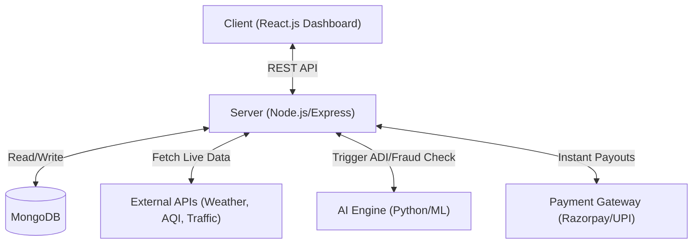
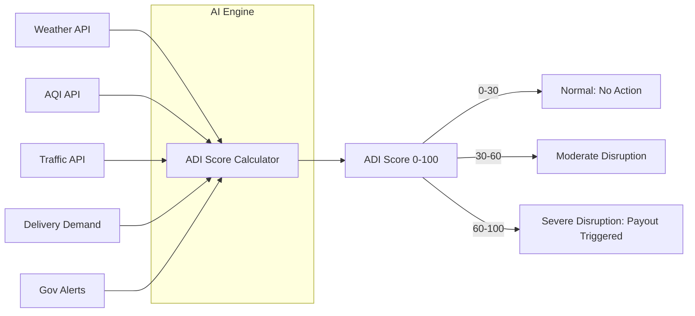
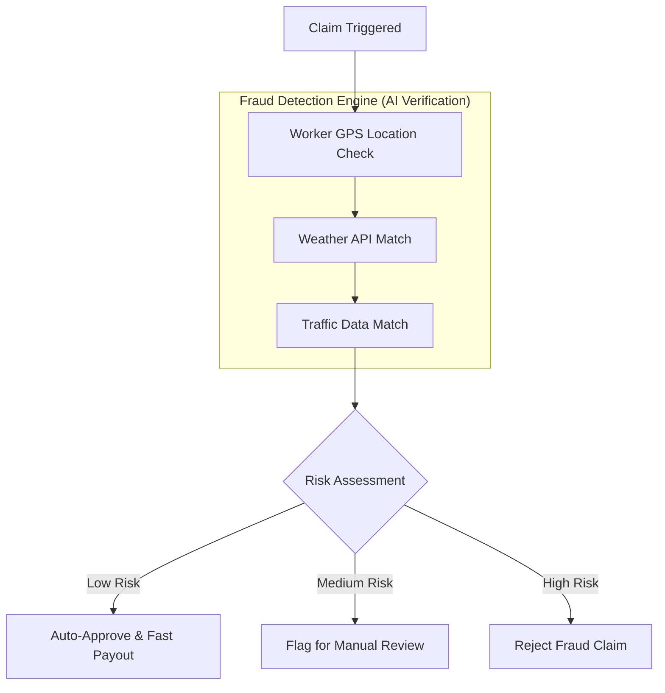

#  AI Disruption Index (ADI) – Smart Income Protection for Gig Workers

A full-stack AI-driven microinsurance platform that protects gig economy delivery workers from income loss caused by environmental disruptions — bad weather, traffic congestion, poor air quality, and zone restrictions. It uses real-time external data to automatically assess risk, trigger claims, detect fraud, and process instant payouts.

## Features

- **Real-time AI Disruption Index (ADI)** scoring using live weather, traffic, AQI, and delivery demand data
- **Automatic claim triggering** when disruption exceeds thresholds — zero manual input from workers
- **5-layer AI fraud detection** with GPS validation, activity checks, duplicate detection, pattern analysis, and API verification
- **Instant UPI payouts** via Razorpay — approved claims are paid out in minutes
- **Worker dashboard** with real-time ADI scores, active policies, claim history, and payout tracking
- **Policy management** with affordable microinsurance plans designed for gig workers

## Built With

* **Frontend**: React.js
* **Backend**: Node.js, Express.js
* **Database**: MongoDB
* **AI Engine**: Python (scikit-learn / pandas)
* **Payment Gateway & Payouts**: Razorpay API (Instant UPI)
* **External Live APIs**: OpenWeatherMap (Weather), AQICN (Air Quality), TomTom (Traffic)

## Repository Layout

```
GigShield/
├── client/                    — React.js frontend (worker dashboard & web app)
├── server/                    — Node.js / Express backend (API & business logic)
│   ├── controllers/           — Route handlers
│   ├── models/                — MongoDB schemas
│   ├── routes/                — API endpoints
│   └── services/
│       ├── adiService.js      — ADI score calculation
│       ├── fraudService.js    — Fraud detection engine
│       └── payoutService.js   — Razorpay integration
├── ai-engine/                 — Python ML models
│   ├── adi_model.py           — Disruption Index model
│   └── fraud_model.py         — Fraud detection model
├── docs/                      — Architecture diagrams
└── README.md
```

Key backend files:

- `server/server.js` — application entry
- `server/services/adiService.js` — ADI score computation from external APIs
- `server/services/fraudService.js` — multi-layer fraud detection logic
- `server/services/payoutService.js` — Razorpay payment processing

Frontend entry:

- `client/src/App.js`

## Prerequisites

- Node.js 18+ and npm
- MongoDB
- Python 3.9+
- Razorpay Sandbox Account
- API keys for OpenWeatherMap, AQICN, TomTom Traffic

## Backend Setup

1. Install dependencies:
   ```bash
   cd server
   npm install
   ```

2. Configure environment variables:
   Create a `.env` file in the `server/` directory:
   ```env
   PORT=5000
   MONGODB_URI=mongodb://localhost:27017/gigshield
   RAZORPAY_KEY_ID=your_razorpay_key
   RAZORPAY_SECRET=your_razorpay_secret
   WEATHER_API_KEY=your_openweathermap_key
   AQI_API_KEY=your_aqicn_key
   TRAFFIC_API_KEY=your_tomtom_key
   JWT_SECRET=your_jwt_secret
   ```

3. Run the backend (development):
   ```bash
   npm run dev
   ```

## Frontend Setup

1. Install dependencies and run the React app:
   ```bash
   cd client
   npm install
   npm start
   ```

2. Open the app at `http://localhost:3000`.

## AI Engine Setup

1. Install Python dependencies:
   ```bash
   cd ai-engine
   pip install -r requirements.txt
   ```

2. Run the AI engine:
   ```bash
   python adi_model.py
   ```

## Running End-to-End

1. Start MongoDB.
2. Start the backend (see Backend Setup).
3. Start the frontend (see Frontend Setup).
4. Start the AI engine (see AI Engine Setup).

## Architecture

This project is organised as a full-stack AI-powered insurance platform with clear separation of concerns:

**Client (Frontend):**

- React.js app (`client/`) provides the worker dashboard, policy views, claim history, and real-time ADI score display.

**Server (Backend):**

- Express app (`server/server.js`) handles REST API routes, user authentication, and coordinates between AI engine, database, and payment gateway.
- `adiService.js` fetches real-time data from external APIs (Weather, AQI, Traffic, Demand) and computes the AI Disruption Index.
- `fraudService.js` runs 5-layer fraud detection — GPS validation, worker activity check, duplicate claim detection, historical pattern analysis, and API data verification.
- `payoutService.js` integrates with Razorpay/UPI for instant payouts.

**AI Engine:**

- Python-based ML models compute the ADI score (0–100) from real-time features.
- Fraud detection model scores claims as Low / Medium / High risk.

**Data & Flow (The AI Disruption Index - ADI):**

### 1. Basic Idea
Normally, insurance systems trigger payouts using one condition, like heavy rain, flood, or pollution. But in reality, delivery workers lose income because of multiple factors together. So instead of checking one condition, we create an AI Disruption Index (ADI) that measures how much the environment is disrupting delivery work. When the score becomes high, the worker automatically receives an insurance payout.

### 2. What is ADI (AI Disruption Index)?
ADI is a number between 0 and 100.
| ADI Score  | Meaning                                |
|------------|----------------------------------------|
| **0–30**   | Normal conditions                      |
| **30–60**  | Moderate disruption                    |
| **60–100** | Severe disruption → payout triggered   |
*(Example: ADI = 75 means the delivery worker cannot work properly, so the system automatically compensates income loss.)*

### 3. Data Used to Calculate ADI
The AI collects data from multiple sources:
1. **Weather Data** (APIs): Rainfall, Temperature, Storm alerts. *Example: Heavy rain → increases disruption score.*
2. **Traffic Data** (APIs): Road blockage, Congestion, Accidents. *Example: Traffic heavily congested → deliveries slow down.*
3. **Pollution Data** (AQI APIs): AQI level. *Example: AQI > 400 → unsafe for outdoor work.*
4. **Delivery Demand Data**: Number of orders. *Example: Orders drop suddenly → worker income reduces.*
5. **Government Alerts**: Curfew, Strike, Zone closure. *Example: These events directly affect delivery work.*

### 4. AI Calculation Example
The AI combines all these factors. 
**Formula Example:** `ADI Score = (0.35 × Weather) + (0.20 × Traffic) + (0.15 × Pollution) + (0.20 × Demand Drop) + (0.10 × Gov Alerts)`
*Example Values:* Weather=80, Traffic=60, Pollution=20, Demand=70, Gov Alert=0.
*Calculation:* ADI = 65. Since ADI > 60 → disruption detected.

### 5. Real Scenario Example
**Worker**: Arjun (Zomato delivery partner)  
**Situation**: Heavy rain in city, traffic jam, many orders cancelled.  
**AI Calculates**: Weather risk = 85, Traffic risk = 70, Demand drop = 60.  
**ADI Result**: **72**. System detects severe disruption.

### 6. Automatic Insurance Flow
1. **Worker Registration**: Worker chooses weekly insurance (e.g., ₹20 per week).
2. **Real-Time Monitoring**: The system continuously monitors weather, traffic, pollution, and delivery activity.
3. **ADI Calculation**: AI calculates disruption score.
4. **Claim Trigger**: If ADI > 60: Claim is automatically triggered (zero manual application).
5. **Income Compensation**: Worker normally earns ₹120/hr. Disruption duration 4 hours. Compensation: ₹120 × 4 = ₹480 sent via UPI / payment gateway.

### 7. Fraud Detection (Important for Judges)
AI checks: Worker GPS location, Weather data, Traffic conditions.
*Example*: Worker claims rain but weather API shows clear weather. System flags fraud claim.

### Fraud Risk Scoring

| Risk Level     | Action                    |
|----------------|---------------------------|
| Low Risk       | Auto-approve → Instant payment |
| Medium Risk    | Flag for manual review    |
| High Risk      | Reject claim              |

## Architecture Diagrams

**System Architecture:**



**ADI Model Flow:**



**Fraud Detection Pipeline:**



## Development Notes

- API routes are in `server/routes/` and controller logic in `server/controllers/`.
- ADI computation logic lives in `server/services/adiService.js` and the Python model in `ai-engine/adi_model.py`.
- Fraud detection checks are modular — each layer (GPS, activity, duplicate, pattern, API) can be independently toggled.
- MongoDB stores user profiles, policies, claims, transactions, and audit logs.
- Payment integration uses Razorpay Sandbox for development; switch to production keys for deployment.

## Team

**Team STARK** — Built for the Guidewire Hackathon

## Contributing

Feel free to open issues or pull requests. For local contributions:

- Follow the setup steps above for backend, frontend, and AI engine
- Run linting and tests (add test commands as project grows)
